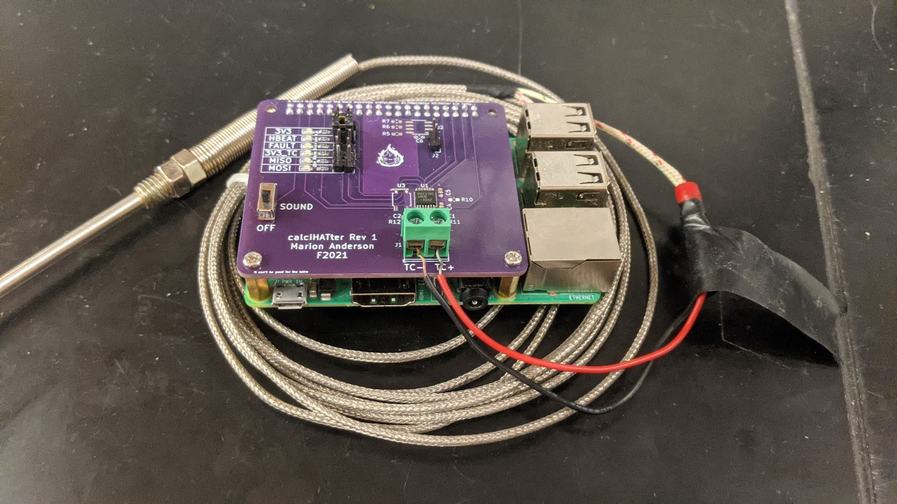

# calcifer
Raspberry Pi Talking Fireplace



## Quick Start
1. Use AdaFruit's [MAX31856 breakout board](https://www.adafruit.com/product/3263) and a fire-resistant [thermocouple](https://www.adafruit.com/product/3245) setup.
2. Follow this [AdaFruit wiring guide](https://learn.adafruit.com/adafruit-max31856-thermocouple-amplifier/python-circuitpython) and connect `DRDY` to `Board D27` and `FAULT` to `Board D20`
3. Put the thermocouple in your fireplace
4. Connect a speaker to the RPI headphone jack
5. Run the following in the terminal:
```
> git clone https://github.com/lowdrant/calcifer.git
> sudo apt install python3-pip           # skip if pip3 installed
> cd calcifer
> ./install.sh                           # install dependencies
> sudo ./boot-setup.sh ADAFRUIT          # setup calcifer to run at boot (daemon)
> sudo systemctl start calcifer.service  # start daemon
> journatlctl -f -u calcifer.service     # stream log output
```

### Using with calciHATter PCB
calciHATter Pi HAT wiring is stored in the CALCIHATTER section of [calcifer.ini](calcifer.ini). After dependencies are installed, you only need to configure which config section Calcifer uses.
```
> sudo ./boot-setup.sh CALCIHATTER
> sudo systemctl restart calcifer.service
```

## Adding Sounds
Add .wav files to the [sounds/](sounds/) directory to add sounds for Calcifer. Calcifer plays a random .wav file from [sounds/](sounds/) when it detects a fire has started. This ensures Calcifer only plays a sound once rather than playing sounds constantly while a fire is going.

## Customizating Behavior and Pinout
[calcifer.ini](calcifer.ini) can be edited to configure entire hardware pinout and some program logic. It is parsed using Python3's `ConfigParser` object. After editing the config section the Calcifer daemon is using, run
```
> sudo systemctl restart calcifer.service
```
to reinitalize Calcifer with the new configuration. Since the config _section_ isn't changing, there's no need to resetup the daemon.

To change configuration sections (e.g. from ADAFRUIT to CALCIHATTER), run
```
> sudo ./boot-setup.sh <your-section>
```

### GPIO Configuration
GPIO values need to be of the form `board.XX` as if they are commands in a Python script because [calcifer.py](calcifer.py) uses `eval(<param>)` to configure GPIO objects. Look into CircuitPython for more details.

| Field       | Desc                       | Example     | Notes                               |
| ----------- | -------------------------- | ----------- | ----------------------------------- |
| spi         | Amplifier SPI bus          | board.SPI() | RPi SPI busses are weirdly specific |
| cs          | Amplifier chip select      | board.D22   | Digital Output                      |
| drdy        | Amplifier data ready pin   | board.D27   | Digital Input                       |
| tc_fault    | Amplifier fault pin        | board.D3    | Digital Input                       |
| tc_reset    | Amplifier power switch pin | board.D26   | Digital Output                      |
| soundswitch | Toggle sound playing       | board.D2    | Digital Input; play sound if high   |
| hbeat       | Heartbeat LED              | board.D21   | Digital Output                      |
| fault       | Fault indicator LED        | board.D20   | Digital Output                      |

### Temperature Logic
Configure temperature sensor type, active/inactive temperature thresholds, and data reading frequency. `thresh` and `off_thresh` introduce hysterisis

| Field      | Desc                            | Example | Notes                                |
| ---------- | ------------------------------- | ------- | ------------------------------------ |
| tctype     | Thermocouple type               | K       | `adafruit_max31856.ThermocoupleType` |
| thresh     | threshold for fire-on state     | 100     | degC float                           |
| off_thresh | threshold for fire-off state    | 50      | degC float; must be less than thresh |
| T_read     | sample period in fire-off state | 1       | seconds                              |
| T_going    | sample period in fire-on state  | 10      | seconds                              |

### Misc Behavior
This does not affect the user experience.
| Field              | Desc                         | Example   | Notes                 |
| ------------------ | ---------------------------- | --------- | --------------------- |
| host               | Host for daemon stop command | 127.0.0.1 | host must be RPi      |
| port               | Port for daemon stop command | 10000     |                       |
| loglevel           | log level to stdout          | DEBUG     | logging library value |
| drdy_count_timeout | Timeout for amp power cycle  | 3         | int                   |
| T_hbeat            | Heartbeat period             | 2         | seconds               |

## Design Overview
### Hardware
The calciHATter PCB conforms to the Raspberry Pi HAT standard. It is a bare-bones PCB that allows a Pi to interface with the MAX31856 over SPI, a sound switch for enabling/disabling Calcifer, debug LEDs, and the configuration EEPROM. Its documentation, fabrication files, and bill of materials can be found in [calciHATter/](calciHATter/). It was designed in KiCAD. I do not provide a means to program the HAT EEPROM with pinout information.

### Software
The Calcifer daemon simply calls [calcifer.py](calcifer.py) with appropriate command line arguments.
[boot-setup.sh](boot-setup.sh) provides a CLI to automatically configure `calcifer.service` for SystemD.

Calcifer program logic is packaged as an object inside a CLI script to run the Calcifer mainloop in a clean, stateful way while also providing a basic testing/characterization interface for thermocouple evaluation and debugging.

The Calcifer object uses 3 threads in its mainloop
1. `_run`, which measures temperature and plays sound if fire goes from off to on
2. `_hbeat`, which blinks the heartbeat LED
3. `_listen`, which listens for a shutdown command on `host:port` and joins the mainllop threads on receipt of said shutdown command


### Fixing Sound Issues
Some PyGame dependencies need to be built from source (namely LibSDL2) for unknown reasons. `install.sh` should handle this, but if you are still getting sound issues, run the below to install the dependencies directly.
```
> ./install-pygame-deps.sh
```

## Author
Marion Anderson - [lmanderson42@gmail.com](mailto:lmanderson42@gmail.com)
